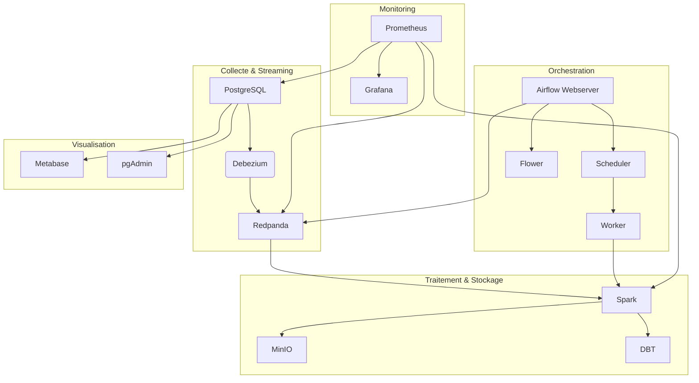

# Sport Data Solution — Stack Docker Complète

## 🏋️ Objectif

Prototype d'une architecture de données moderne pour analyser l'activité sportive des employés, incluant collecte, traitement, orchestration, monitoring et visualisation.

Projet réalisé dans le cadre de l'option B "Créez et automatisez une architecture de données".

---

## 🧰 Stack technique

### Ingestion et streaming

* **PostgreSQL** : base source de données (CDC activée)
* **Debezium** : capture de changements (CDC) PostgreSQL → Redpanda
* **Redpanda** : broker Kafka-compatible pour les flux de données

### Traitement et stockage

* **Spark** : traitement distribé batch & streaming
* **MinIO** : stockage objet S3-compatible (Data Lake)
* **DBT** : transformations SQL modélisées (modèles, tests)

### Orchestration et automatisation

* **Airflow (CeleryExecutor)** : DAGs, workers, Flower, Redis

### Monitoring

* **Prometheus** : collecte des métriques
* **Grafana** : dashboards techniques
* **ntfy** : alertes dev/ops en temps réel

### Visualisation et exploration

* **Metabase** : BI no-code sur PostgreSQL
* **pgAdmin** : interface SQL d'administration

### Simulation / Scripts

* **Python** : simulateur d'activités sportives (init, trajets)

---

## 🔄 Architecture visuelle



---

## 🔍 Lancement rapide

1. Copier `.env` à la racine du projet et l'adapter si besoin.
2. Lancer la stack principale + services complémentaires :

```bash
docker compose -f docker-compose.yml \
  -f docker-compose.override.airflow.yml \
  -f docker-compose.override.monitoring.yml \
  -f docker-compose.override.metabase.yml \
  -f docker-compose.override.pgadmin.yml \
  -f docker-compose.override.dbt.yml up -d
```

3. Accéder aux interfaces :

* Airflow : [localhost:8082](http://localhost:8082)
* Flower : [localhost:5556](http://localhost:5556)
* Grafana : [localhost:3000](http://localhost:3000)
* Prometheus : [localhost:9090](http://localhost:9090)
* Metabase : [localhost:3001](http://localhost:3001)
* pgAdmin : [localhost:5050](http://localhost:5050)
* MinIO : [localhost:9001](http://localhost:9001)

---

## 🌐 .env unifié

Toutes les variables de configuration sont centralisées dans le fichier `.env` : ports, utilisateurs, mots de passe, hôtes, chemins, options simulation, clés API (Google Maps).

---

## ✅ Statut

Stack fonctionnelle, testée localement sur Docker Desktop. Prochaine étape : automatisation des pipelines (DAGs Airflow), intégration Slack & Power BI.

---

## 🎓 Auteur

Xavier Rousseau, Juin 2025 — Projet de formation Sport Data Solution
